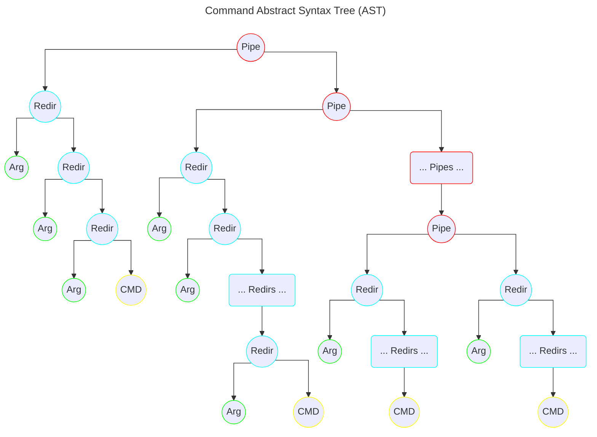

<h1 align="center">
	Minishell
   
</h1>

## Design
There are two main components on a shell:
- **Analyzer**
- **Evaluator**

### Interface
In this *minishell*, the interface is very small and is mostly a tool for the **Analyzer** since it doesn't handle any pointer interaction.
However it does handle:
- A prompt to input a command
- History
- Handles user signals:
  | Key Combination | Signal Name     |
  |-----------------|-----------------|
  | `ctrl-C`        | SIGINT          |
  | `ctrl-D`        | EOF (End of File) |
  | `ctrl-\`        | SIGQUIT         |

### Analyzer
The analyzer takes the command, analyze the *lexic*, *syntax* and *semantic*, and process the data into an **Command AST**, that the **Evaluator** will take and use it to evaluate the command, redirection, pipe, etc.
It handles:
- Lexic Analysis
- Syntax Analysis
- Semantic Analysis
- Quotes
  | Quotes         | Behavior                               |
  |----------------|----------------------------------------|
  | Single quotes  | Prevent interpreting anything inside.  |
  | Double quotes  | Prevent interpreting anything except `$` inside. |
  - Not interpret unclosed quotes
- Translations
  - meta-characters
  - Relative path from command to absolute path
  - Env variables
  - $? *which the evaluator has to save*

### Evaluator
The evaluator takes the **Command AST**, launch the appropriate executable on a child process, handling pipes, signal inheritance, **clean** process management, etc.
- Search and launch executables
  - Based on the `PATH` env variable.
  - Based on an aboslute path
  - Based on builtins commands
- Interpret *redirections* and *pipes*
  | Redirection Symbol | Description                                                    |
  |--------------------|----------------------------------------------------------------|
  | `<`                | Redirects input.                                               |
  | `>`                | Redirects output.                                              |
  | `<<`               | Reads input until a line containing the delimiter is seen.     |
  | `>>`               | Redirects output in append mode.                               |
- Builtins
  | Command           | Option           |
  |-------------------|------------------|
  | `echo`            | `-n`             |
  | `cd`              | Only a relative or absolute path |
  | `pwd`             | No options        |
  | `export`          | No options        |
  | `unset`           | No options        |
  | `env`             | No options or arguments |
  | `exit`            | No options        |

### Entity Relationship Diagram

